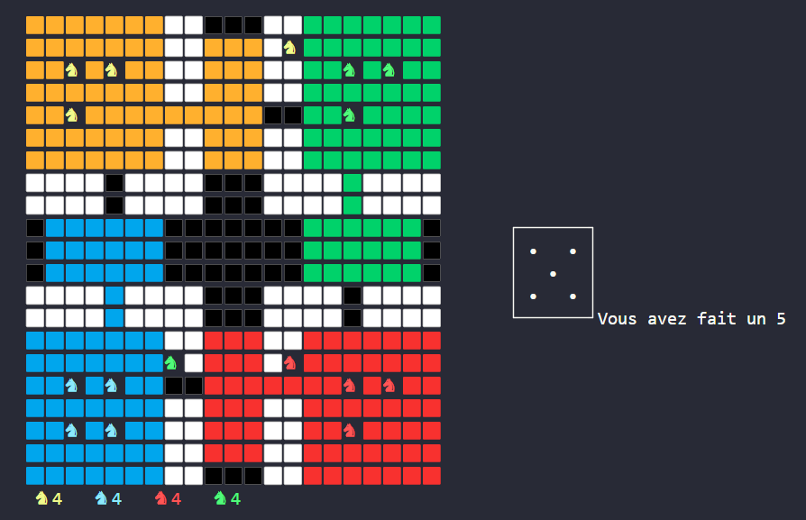

# Parcheesi

## Résumé
  

Ce repos est un projet d'info de P1 à l'école [Cytech](https://fr.wikipedia.org/wiki/CY_Tech) (ex EISTI)

Le projet est un jeu du  [Parcheesi](https://fr.wikipedia.org/wiki/Parcheesi) écrit en C pour Linux 64bits.

## Règles
Voici les règles du Parchessi :
### Général
    • Le jeu se joue à 4 joueurs. En cas de manque de joueur, des robots prendront le relais.
    • Les joueurs possèdent 4 couleurs: bleu, rouge ,jaune et verts. Chaque couleur possède 4 pions.
    • Le joueur jaune commence la partie.
### Jeu
    • Pour sortir de la base, il faut faire un 6 avec le dé.
    • On est obligé de sortir un pion dans les deux cas suivants:
        • le premier 
        • Si notre base est occupé par un pion (obligation de manger)
    • Les chevaux tournent dans le sens inverse d'une aiguille d'une montre.
### Conditions de victoire
    • Pour commencer à rentrer dans l'escalier, ils doivent tomber pile sur la case grise. Si le joueur dépasse la case grise, il ne bouge pas. 
    • Si aucun pion ne peux bouger, alors il passe son tour.
    • Le premier joueur qui rentre ses 4 pions gagne la partie. 

## Membre de l'équipe

Lucas Serrano, Léon Bouchereau, Ambre Florette et Bixente Hiriart--Dicharry